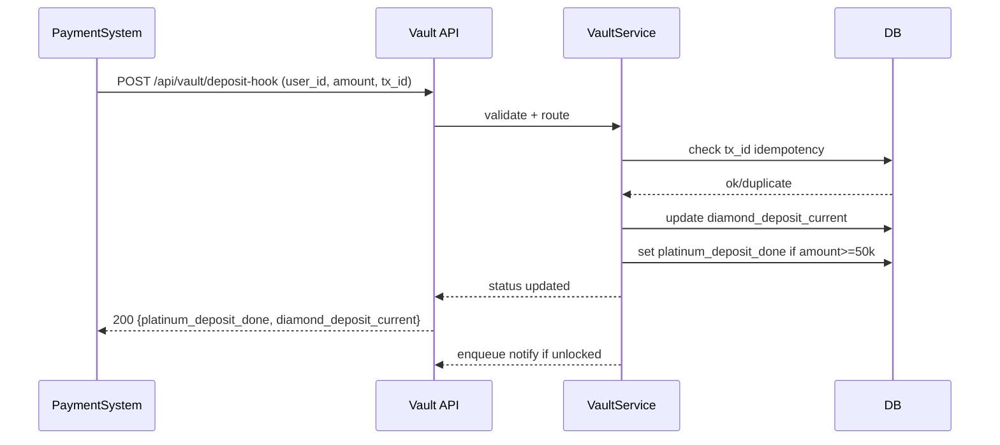
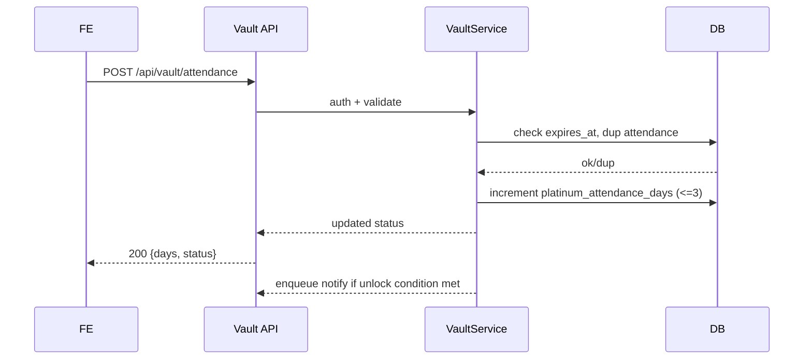
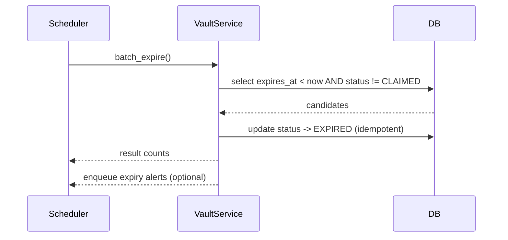
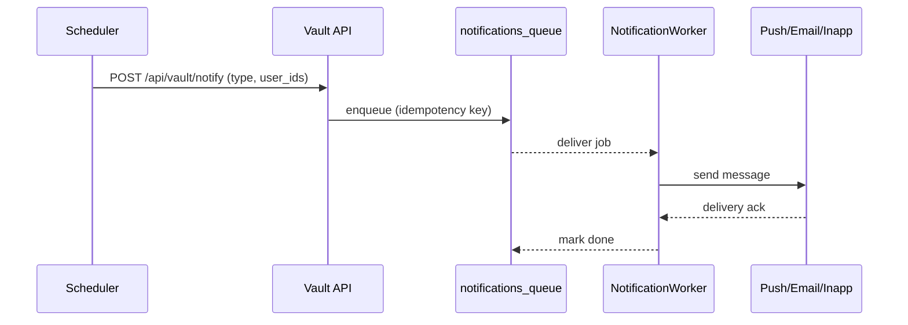
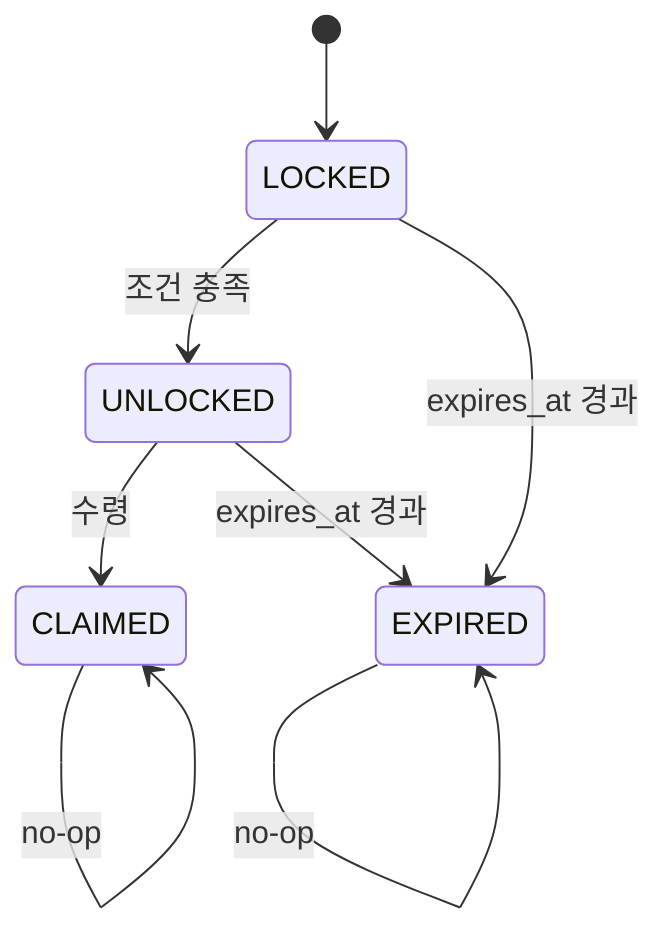
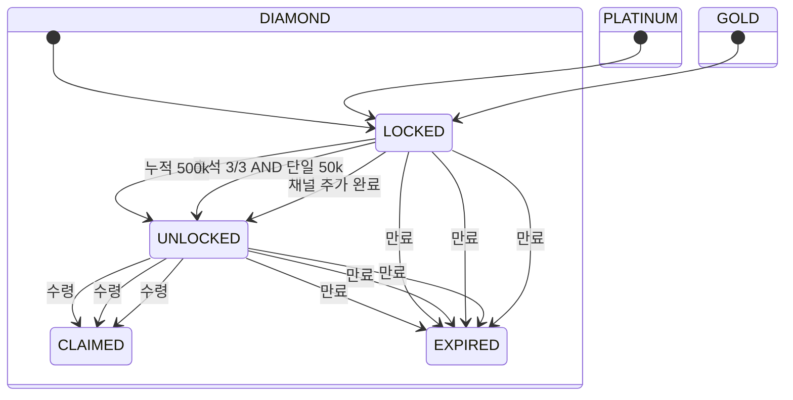
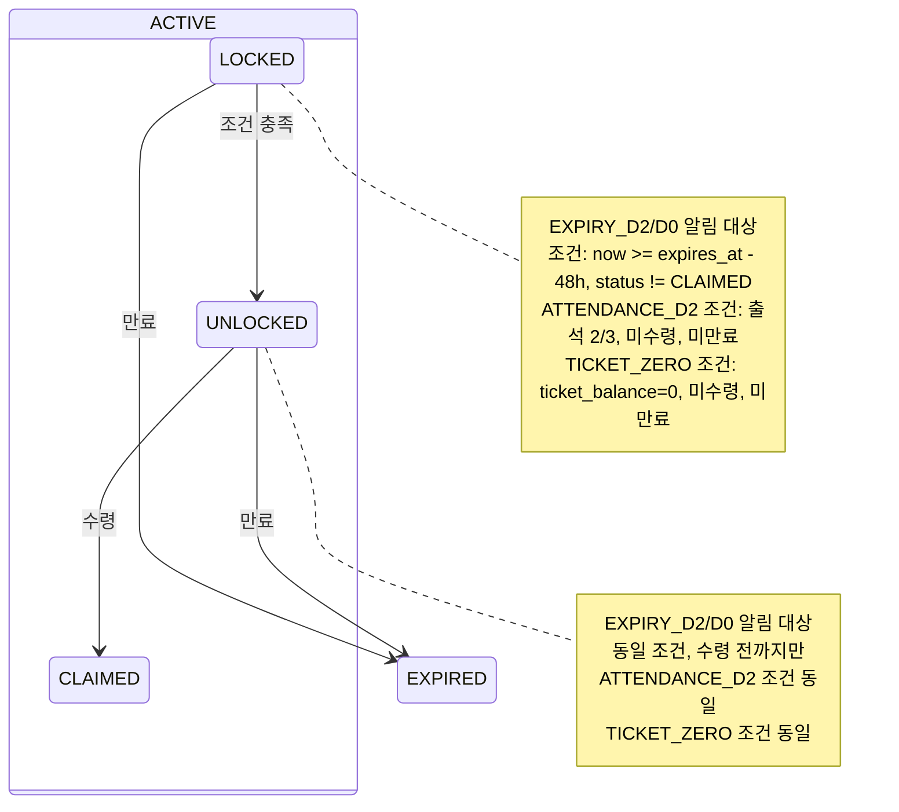

# Vault v2.0 시퀀스/상태 다이어그램(텍스트)

## 1. 메타
- 문서 타입: 시퀀스/상태
- 버전: v0.2
- 작성일: 2025-12-20
- 대상: 백엔드/프론트엔드/기획자

## 2. 시퀀스: 입금 훅
- Actor: PaymentSystem → API /api/vault/deposit-hook → VaultService
- 플로우:
  1) PaymentSystem → deposit-hook (user_id, amount, tx_id, occurred_at)
  2) VaultService: idempotency(tx_id) 검사
  3) amount 누적 → diamond_deposit_current 업데이트
  4) amount >= 50,000 → platinum_deposit_done=true
  5) 조건 충족 시 상태 UNLOCKED 전이 + 알림 enqueue

## 3. 시퀀스: 출석
- Actor: FE → /api/vault/attendance
- 플로우:
  1) Auth 유저 검증, expires_at 확인
  2) 중복 출석 체크 (일자별 락)
  3) platinum_attendance_days += 1 (최대 3)
  4) (출석 3 AND 50,000 단일 충전) → 플래티넘 UNLOCKED + 알림 enqueue

## 4. 시퀀스: 만료 배치
- Actor: Scheduler → VaultService.batch_expire
- 플로우:
  1) expires_at < now AND status != CLAIMED 인 레코드 스캔
  2) 상태를 EXPIRED로 업데이트 (idempotent WHERE)
  3) 소멸 알림 enqueue (옵션)

## 5. 시퀀스: 알림 전송
- Actor: Scheduler → /api/vault/notify (또는 내부 큐)
- 플로우:
  1) 필터링 (D-2, D0, 티켓0 등)
  2) notifications_queue enqueue (idempotency key)
  3) Notification worker → Push/Email/In-app 발송
  4) 클릭/열람/수령 이벤트 로그

## 5.1 시퀀스: 부활권/만료 연장
- Actor: FE(사용자 초대) 또는 Admin → /api/vault/referral-revive · /api/vault/extend-expiry
- 플로우(사용자 부활권):
  1) FE → referral-revive (request_id, channel, invite_code)
  2) Service: expires_at - now ∈ [24h,48h], expiry_extend_count=0 검사
  3) expires_at = expires_at + 24h, expiry_extend_count +=1, extension_log insert(reason=REFERRAL)
  4) 응답 200 {revived:true, expires_at:new}
- 플로우(운영 연장/드라이런):
  1) Admin → extend-expiry(scope, extend_hours, reason, shadow?)
  2) shadow=true: 대상만 계산해 리포트(미반영), extension_log에 shadow=true 기록
  3) shadow=false: 대상 업데이트 + extension_log insert(reason=OPS/PROMO/ADMIN)
  4) 슬랙/모니터링에 결과 전송

## 5.2 시퀀스: 보상 재시도 (compensation_queue)
- Actor: Claim API → CompensationWorker
- 플로우:
  1) Claim 시 외부 보상(포인트/쿠폰) 호출 실패 → 202 Accepted + compensation_queue enqueue(request_id, payload)
  2) 워커가 next_retry_at 도래 시 재시도 (지수백오프)
  3) 성공 → DONE 후 vault 상태/로그 업데이트, 실패 누적 → FAILED + DLQ 알림

## 6. 상태 머신 요약 (텍스트)
- 공통: LOCKED → UNLOCKED → CLAIMED, 만료 시 EXPIRED
- Gold: 채널 추가 시 UNLOCKED → CLAIMED
- Platinum: (출석 3 AND 단일 50,000 충전) → UNLOCKED → CLAIMED
- Diamond: (누적 500,000 충전) → UNLOCKED → CLAIMED
- 만료: expires_at 도래 시 LOCKED/UNLOCKED는 EXPIRED로 전환

## 7. 상태 전이 가드
- EXPIRED이면 어떤 액션도 거부
- CLAIMED이면 중복 수령 거부
- 출석은 하루 1회, 서버 날짜 기준
- deposit-hook은 tx_id idempotent
- expires_at 연장은 EXPIRED/CLAIMED 이후 불가, REFERRAL 이유는 1회 제한

## 8. 다이어그램 참고
- 시각 다이어그램이 필요하면 draw.io/mermaid로 표현 (추후 추가)

## 9. Mermaid 시퀀스 다이어그램 (예시)

### 9.1 출석 시퀀스

### 9.2 만료 배치 시퀀스

### 9.3 알림 전송 시퀀스

## 10. Mermaid 상태 다이어그램 (금고 공통)

## 11. Mermaid 상태 다이어그램 (개별 금고 조건)

## 12. 소멸 임박 알림 상태 노트 (텍스트)
- 알림 조건 (예시)
  - EXPIRY_D2: now >= expires_at - 48h AND status != CLAIMED
  - EXPIRY_D0: now >= expires_at (당일) AND status != CLAIMED
  - ATTENDANCE_D2: platinum_attendance_days = 2 AND platinum_status != CLAIMED AND now < expires_at
  - TICKET_ZERO: ticket_balance = 0 AND platinum_status != CLAIMED AND now < expires_at
- 전이 영향
  - LOCKED/UNLOCKED 상태에서만 임박 알림 트리거
  - CLAIMED/EXPIRED는 알림 비대상
- Mermaid 주석 예시

